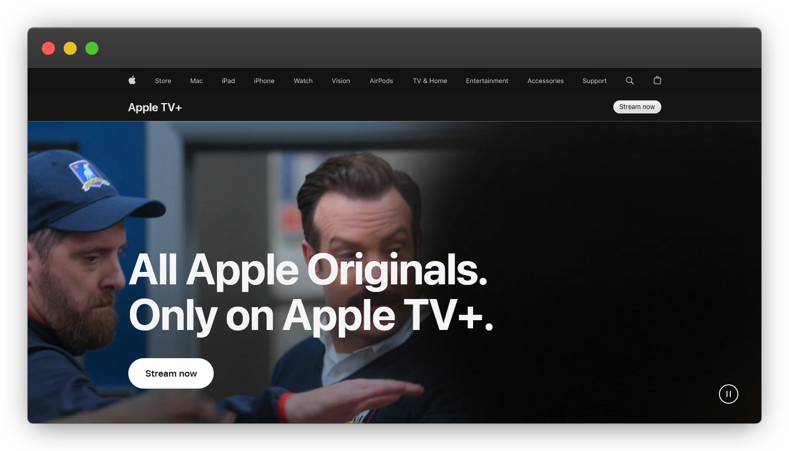

# Apple TV+ Clone Website

This project is a clone of the Apple TV+ website created using HTML, SCSS, JavaScript, and GSAP. It serves as both a learning exercise and a showcase of skills in front-end web development.



## Table of Contents

- [About](#about)
- [Features](#features)
- [Technologies Used](#technologies-used)
- [Installation](#installation)
- [Usage](#usage)
- [Acknowledgements](#acknowledgements)
- [License](#license)

## About

This project was undertaken to deepen my understanding of front-end web development concepts and techniques. By recreating the Apple TV+ website, I aimed to hone my skills in HTML markup, SCSS styling, JavaScript functionality, and GSAP animations.

## Features

- **Responsive Design:** The website is designed to be fully responsive, ensuring a seamless experience across various devices and screen sizes.
- **Dynamic Content:** JavaScript is used to dynamically load content, providing a smooth and interactive browsing experience.
- **Animations:** GSAP (GreenSock Animation Platform) is utilized to create engaging animations and transitions throughout the website.
- **Custom Styling:** SCSS preprocessing is employed for efficient and maintainable styling, allowing for easy customization and scalability.

## Technologies Used

- HTML
- SCSS
- JavaScript
- GSAP (GreenSock Animation Platform)

## Installation

To run this project locally, follow these steps:

1. Clone the repository:

   ```
   git clone https://github.com/your-username/apple-tv-plus-clone.git
   ```

2. Navigate to the project directory:

   ```
   cd apple-tv-plus-clone
   ```

## Usage

Once the project is installed, you can open the `index.html` file in your web browser to view the Apple TV+ clone website. Explore the different pages and features to see the implementation of HTML, SCSS, JavaScript, and GSAP in action.

## Acknowledgements

I would like to express my gratitude to the creators of the original Apple TV+ website for providing inspiration and a valuable learning opportunity. Additionally, I extend thanks to the developers of GSAP for their powerful animation library.

## License

This project is licensed under the [MIT License](LICENSE). Feel free to use, modify, and distribute the code for your own educational and non-commercial purposes.